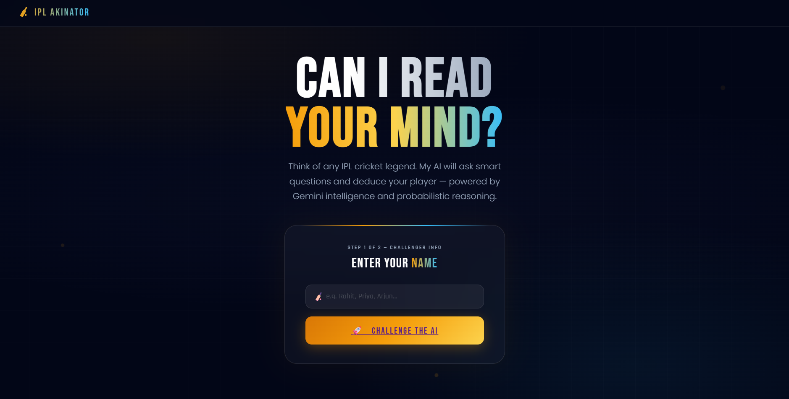
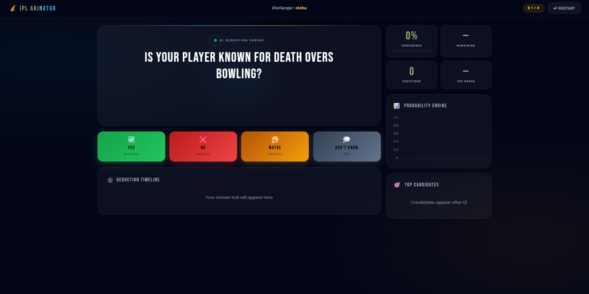

# IPL-Akinator

## Overview

IPL-Akinator is an interactive IPL player guessing game built with a FastAPI backend and a lightweight HTML frontend. The app combines probabilistic reasoning, entropy-based question selection, and AI-assisted question generation to identify a player from a curated IPL roster.

The game flow is designed to ask the user a sequence of player-related questions, update candidate probabilities with each answer, and make a confident guess when enough evidence is gathered.

## What makes it special

- Hybrid AI + probabilistic engine for smarter predictions
- Bayesian inference for dynamic player likelihoods
- Entropy-based feature selection for efficient questioning
- Session memory for context-aware reasoning
- Player profile and embedding data stored in JSON
- Frontend gameplay experience with question/answer interaction

## Screenshots

## Users and contacts

>)

- Contact: open an issue on GitHub for questions, feature requests, or bug reports.
